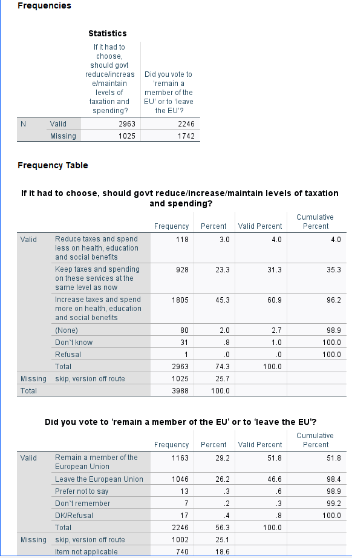

```{r setup, include=FALSE}
knitr::opts_chunk$set(echo = TRUE)
```
```{r klippy, echo = F, include=TRUE}
klippy::klippy()
```

This exercise is part of the Skills for Surveys course. In the exercise, we examine data from the British Social Attitudes 2020 survey to find out:

* what proportion say they voted remain in the EU Referendum?

* whether people think the government should raises taxes and spend more or reduce tax and cut social expenditure?

* how much people think they'll get from the State pension? 

# 1. Getting started 

You can access the data from the UK Data Service website (following a registration). However, for this session, we recommend that you access a workshop folder containing the data and follow the steps below. 

Download the folder, unzip and save it somewhere accessible on your computer. 

Once you have the workshop folder saved, set the folder as your working directory in your software. To do this, you need to add the correct file path to the folder on your computer to the code below. 

```
*The directory path in "" needs to be changed for your own. 
cd "C:\Users\qtnvpw1\Dropbox\work\UKDS\DSP\BSA".
show DIRECTORY.
```


If you have your working directory saved to the folder location, the following code should open the BSA dataset. 

```
GET FILE='BSA\UKDA-9005-spss\spss\spss25\bsa2020_archive.sav'.
```


# 2. Explore the dataset 

Start by getting an overall feel for the dataset. Either inspect variables and cases in the data editor or use the code below to produce a summary of all the variables in the dataset. 

```
CODEBOOK all. 
```


**Questions**

1. What is the overall sample size?
2. How many variables are in the dataset?


Now, focus on the three variables we will use. 

```
CODEBOOK TAXSPEND EUVOTWHO PenExp2.  
```


**Questions 3**
What do the variables measure and how?* 


# 3. Missing values

Review the frequency tables, examining the not applicable and don't know categories. 

**Question 4** Why for EUVOTWHO are there so many not applicable? Note, you can use the documentation to check if needed. What does this mean when it comes to interpreting the percentages? 

Now, set all item missing responses including don't knows and prefer not to say as missing values.

The SPSS syntax below includes the command, the variables and the relevant missing values in (). Note, you can set missing values more than 1 at a time if they have the same missing value pattern.

```
MISSING VALUES PenExp2 (-1, 9998, 9999). 
MISSING VALUES TAXSPEND (-1, 8, 9). 
MISSING VALUES EUVOTWHO (-1, 3 THRU 9). 
```

# 4. Compare unweighted and weighted frequencies
Let's examine the weighted responses. 

```
WEIGHT Off.
*This line is probably not unnecessary as we have not applied a weight yet; it has been included just to make sure we are looking at unweighed results. 
FREQUENCIES VARIABLES=TAXSPEND EUVOTWHO
  /BARCHART PERCENT
  /ORDER=ANALYSIS.
*Here, we use the FREQUENCIES command for the categorical variables and the EXAMINE command for the continous variables. 
EXAMINE VARIABLES=PenExp2
  /PLOT HISTOGRAM
  /STATISTICS DESCRIPTIVES
  /MISSING LISTWISE
  /NOTOTAL.
```



What is the (unweighted) percent who say they voted remain in the EU referendum? The answer is about 58 percent of those who voted in the referendum say they voted to remain. This figure seems a bit high (though people do not always report accurately). 

Let's add the weight.

```
*The weight is added by the command below. It will remain on for all subsequent analyses. 
WEIGHT BY BSA20_wt_new.
FREQUENCIES VARIABLES=TAXSPEND EUVOTWHO
   /ORDER=ANALYSIS.
EXAMINE VARIABLES=PenExp2
  /PLOT HISTOGRAM
  /STATISTICS DESCRIPTIVES
  /CINTERVAL 95
  /MISSING LISTWISE
  /NOTOTAL.

*To stop weighting the data you can use the following command. 
WEIGHT off. 
```


Now, what proportion say they voted remain in the EU referendum? It is about 54 percent, lower than the unweighted proportion and closer to the actual referendum results. 

# 5. Confidence intervals 

Add confidence intervals to the bar charts and mean to indicate uncertainty due to sampling error. 

```
WEIGHT BY BSA20_wt_new.
GRAPH
  /BAR(SIMPLE)=PCT BY TAXSPEND
  /INTERVAL CI(95.0).

GRAPH
  /BAR(SIMPLE)=PCT BY EUVOTWHO
  /INTERVAL CI(95.0).

EXAMINE VARIABLES=PenExp2
  /PLOT NONE
  /STATISTICS DESCRIPTIVES
  /CINTERVAL 95
  /MISSING LISTWISE
  /NOTOTAL.
```


5. What proportion think government should increase taxes and spend more on health, education and social benefits?
6. How much do people think they will get at state pension age? 

**Additional question**

Select two variables that interest you and examine their distribution. 

# 6. Answers
```{r files,echo=F, include=F}
library(dplyr) ### Data manipulation functions
library(haven) ### Importing stata/SPSS files
library(Hmisc) ### Extra statistical functions

### Setting up the working directory
### Change it to match yours: ie typically 
### `C:/USERS/Your_Username_here/Your_data_folder_here`)

#setwd("/home/piet/Dropbox/work/UKDS/Surveyskills")
setwd("C:/Users/qtnvpw1/Dropbox/work/UKDS/DSP")

getwd()

# Opening the BSA dataset in SPSS format
bsa20<-read_spss('BSA/data/UKDA-9005-spss/spss/spss25/bsa2020_archive.sav') 

bsa20<-bsa20%>%mutate(
              TAXSPEND.r=factor(as_factor(TAXSPEND,"labels"), 
                                exclude = c("Prefer not to answer",
                                            "Don't know")),
              EUVOTWHO.r=factor(as_factor(EUVOTWHO,"labels"),
                                exclude = c("Prefer not to answer",
                                            "I Don't remember","Not applicable",NA)),
              PenExp2.r=ifelse(PenExp2==-1 | PenExp2>=9998,NA,PenExp2)
                      )
### Value labels need to be truncated as they are rather lengthy!
levels(bsa20$TAXSPEND.r)<-substr(levels(bsa20$TAXSPEND.r),1,14)
levels(bsa20$EUVOTWHO.r)<-substr(levels(bsa20$EUVOTWHO.r),1,6)

levels(bsa20$TAXSPEND.r)
levels(bsa20$EUVOTWHO.r)

# Raw output
wtd.table(bsa20$EUVOTWHO.r,weights=bsa20$BSA20_wt_new)

# Converted into proportions            
round(
  100*
    prop.table(
      wtd.table(bsa20$EUVOTWHO.r,weights=bsa20$BSA20_wt_new)$sum.of.weights),
  1)

w.n<-sum(wtd.table(bsa20$TAXSPEND.r,weights=bsa20$BSA20_wt_new)$sum.of.weights)

ciprop<-cbind(levels(bsa20$TAXSPEND.r),
round(100*
binconf(wtd.table(bsa20$TAXSPEND.r,weights=bsa20$BSA20_wt_new)$sum.of.weights,w.n),
1)
)

m.p<-wtd.mean(bsa20$PenExp2.r,weights=bsa20$BSA20_wt_new)
se.p<-sqrt(wtd.var(bsa20$PenExp2.r,weights=bsa20$BSA20_wt_new))
n<-sum(bsa20$BSA20_wt_new[!is.na(bsa20$PenExp2)])

ci<-c(m.p,m.p-1.96*(se.p/sqrt(n)),m.p+1.96*(se.p/sqrt(n)))

```

1. There are `r nrow(bsa20)` cases in the dataset.

2. The total number of variables is `r ncol(bsa20)`. 

3. `TAXSPEND` records responses to the questions of whether government should reduce/increase/maintain levels of taxation and spending?	There are three possible responses to the question. `EUVOTWHO` records responses to the question 'Did you vote to 'remain a member of the EU' or to 'leave the EU'?' The responses are `r levels(bsa20$EUVOTWHO.r)[1]`  or `r levels(bsa20$EUVOTWHO.r)[2]`. `PenExp2` contains responses to the question 'How much do you think someone who reaches State Pension age today would receive in pounds per week?'Responses are numeric. 	

4. There are two reasons for the many 'not applicable'. 
* Routing: the question is only asked to those who said yes to a previous question (`EURefV2`). 
* Versions 5 and 6 - The BSA uses a split sample and the question is only asked in Versions 5 and 6. 

5. About `r round(100*prop.table(data.frame(wtd.table(bsa20$TAXSPEND,bsa20$BSA20_wt_new)[2])))[3,1]`% say the government should increase taxes and spend more. 

6. The amount people think they will get at state pension age varies between £0 and £`r max(bsa20$PenExp2.r,na.rm=T)`, with an average in the region between  £`r round(ci[2])` and £`r round(ci[3])`
